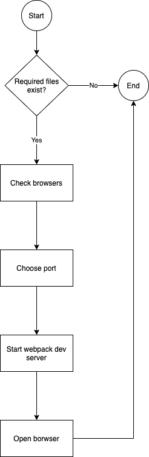
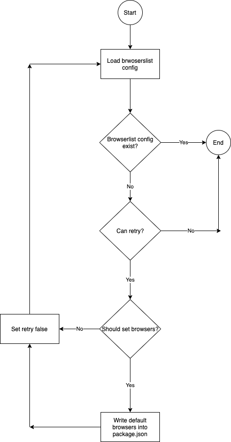
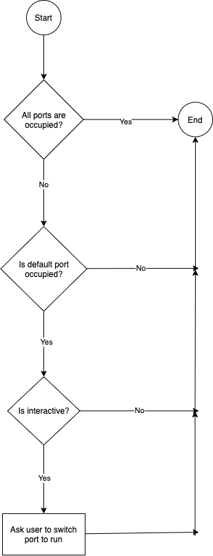

# 1. Overview

In this chapter, we will go through the implementation detail of `npm start` of `create-react-app`.

> React Version: v18.1.0 

The overview steps of `npm start` are below:

1. Check required files.
2. Check browsers.
3. Choose port.
4. Start webpack dev server.
5. Open browser.



# 2. Check required files

The files we need as basic are listed below and all of them are in root folder:

1. `public/index.html`
2. `src/index.js`

# 3. Check browsers

## 3.1 Overview

Checking browsers is to check if user has set the `browserslist` configuration in the project, if not we help uesr to set the default browsers. Below is the overview of `check browsers`:



## 3.2  Load browserslist config

Load the `browserslist` config user have set in the project.

```js
const browserslist = require('browserslist');
browserslist.loadConfig()
```

If the `browserslist` configuration exists, we can resolve this and finish checking browsers. Otherwise need to check this checking behaviour is a second time checking.

## 3.3 Set browsers

If user don't set `browserlist` in project, then we should ask user if set the default `browserlist` in the project.

```js
 const question = {
    type: 'confirm',
    name: 'shouldSetBrowsers',
    message:
      chalk.yellow("We're unable to detect target browsers.") +
      `\n\nWould you like to add the defaults to your ${chalk.bold(
        'package.json'
      )}?`,
    initial: true,
  };

  return prompts(question).then(answer => answer.shouldSetBrowsers);
```

If user allow to set default browsers, then we can write it into the project `package.json`

Default browsers:

```js
const defaultBrowsers = {
  production: ['>0.2%', 'not dead', 'not op_mini all'],
  development: [
    'last 1 chrome version',
    'last 1 firefox version',
    'last 1 safari version',
  ],
};
```

# 4. Choose port

## 4.1 Overview

After checking the browser, we should detect the free port which will run our dev server. In this flow, we have the default port **3000**, below is the overview of detect port:



## 4.2 Detect port

Detect the default port **3000** on the localhost is occupied or not.

```js
const detect = require('detect-port-alt');
const DEFAULT_PORT = parseInt(process.env.PORT, 10) || 3000;
const HOST = process.env.HOST || "0.0.0.0";
detect(defaultPort, host)
```

## 4.3 Switch port

If the default port is occupied, then we need to ask user to switch port by prompts.

```js
const question = {
  type: 'confirm',
  name: 'shouldChangePort',
  message:
    chalk.yellow(
      message +
      `${existingProcess ? ` Probably:\n  ${existingProcess}` : ''}`
    ) + '\n\nWould you like to run the app on another port instead?',
  initial: true,
};
prompts(question)
```

# 5. Start webpack dev server