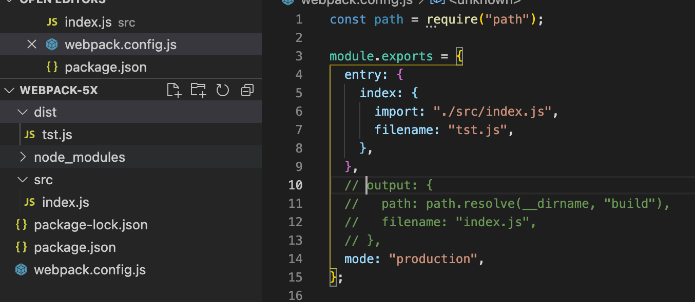

# Single Entry (Shorthand) Syntax

Usage: `entry: string | [string]`

```js
module.exports={
  entry: './src/index.js'
};
```

This single entry syntax for the `entry` property is a shorthand for:

```js
module.exports={
  entry: {
  	main: "./src/index.js"
	}
};
```

We can also use **array** to define to `entry` property which called **multi-main entry**. This is used when we want to inject multiple dependent files together and graph their dependencies into one *chunk*.

```js
module.exports={
  entry: ['./src/index.js','./src/file1.js']
};
```

# Object Syntax

Usage: `entry: { <entryChunkName> string | [string] } | {}`

```js
module.exports={
  entry: {
    app: './src/app.js',
    adminApp: './src/adminApp.js'
  }
};
```

> We can pass `{}` to entry when we have only one entry which is generated by plugin.

## EntryDescription Object

We can pass an object for each entry point. In this object, we can specify the following properties:

* `filename`:  Specifies the name of each output file on disk. We can define this property to identify the output file name without the `output` object.
* `import`: Module(s) that are loaded upon startup. Usage: `import: string | [string]`, same as the entry shorthand syntax.



* `dependOn`: The entry points that the  current entry point depends on. They must be loaded before current entry point is loaded.

* `library`: Specify library options to bundle a library from current entry.
* `runtime`: The name of the runtime chunk. When set, a new runtime chunk will be created. It can be set to `false` to avoid a new runtime chunk since webpack 5.43.0.
* `publicPath`: Specify a public URL address for the output files of this entry when they are referenced in a browser.

```js
module.exports = {
  entry: {
    a2: 'dependingfile.js',
    b2: {
      dependOn: 'a2',
      import: './src/app.js',
    },
  },
};
```

> `runtime` and `dependOn` should not be used together on a single entry.

```js
//below config is invalid and will throw an error
module.exports = {
  entry: {
    a2: './a',
    b2: {
      runtime: 'x2',
      dependOn: 'a2',
      import: './b',
    },
  },
};
```

> `runtime` must not point to an existing entry point name

```js
//below config will throw an error
  entry: {
    a1: './a',
    b1: {
      runtime: 'a1',
      import: './b',
    },
  },
};
```

> `dependOn` must not be circular.

```js
//below config will throw an error
module.exports = {
  entry: {
    a3: {
      import: './a',
      dependOn: 'b3',
    },
    b3: {
      import: './b',
      dependOn: 'a3',
    },
  },
};
```

